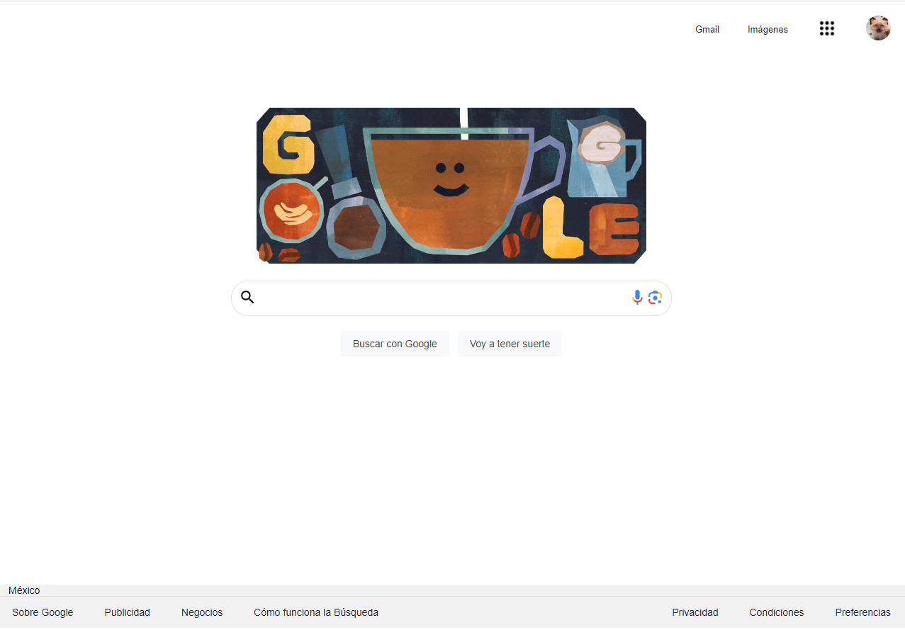

# Mi clon de Google en TECNOLOCHICAS PRO 💜

**El presente proyecto es un clon de la página de Google desarrollado para poner en práctica las habilidades obtenidad dentro del bootcamp de desarrollo frontend de Technolochicas PRO.**

**Fue desarrollado con HTML y CSS.**

La página es responsiva (adaptable a diferentes tamaños de pantalla) e incluye la presentación de la autora del proyecto.

## Secciones de mi sitio

## Tecnologías

* HTML
* CSS

---

Desarrollado con  💜 por [Damaris](http:) en [TECNOLOCHICAS PRO](https://tecnolochicas.mx/)
